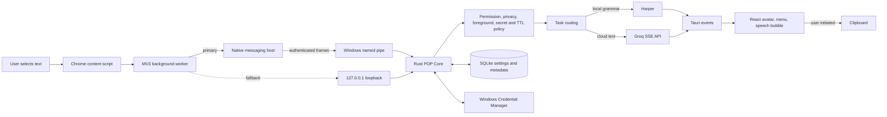
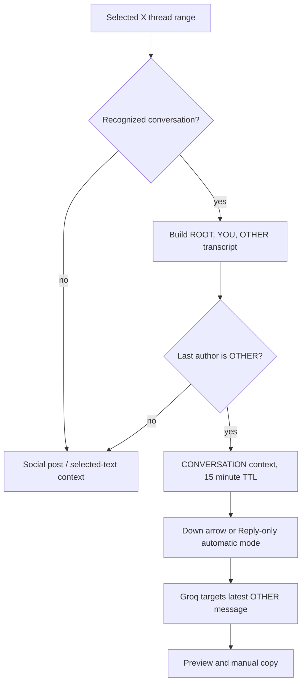
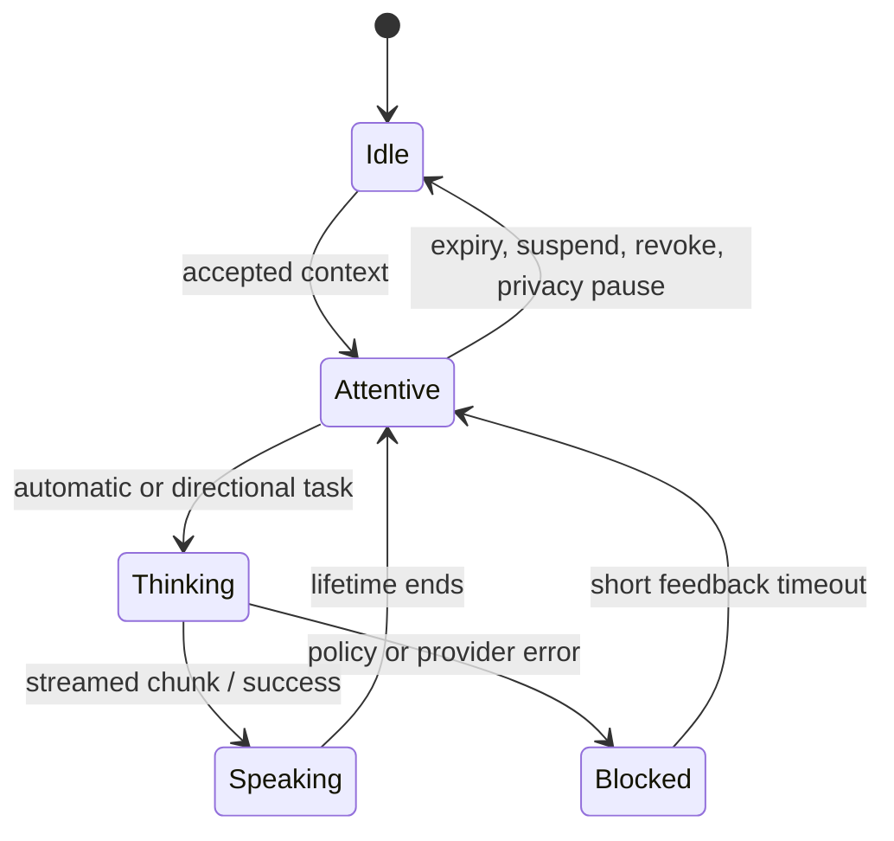
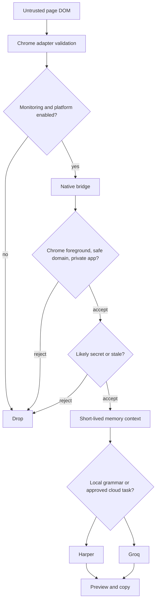
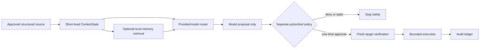

# POP Complete Architecture and Engineering Guide

> **Source-of-truth snapshot:** repository state at commit e5ed29d on 2026-09-16.
> This guide is reverse engineered from executable code, tests, configuration, and runtime scripts.
> It separates live behavior from future design documents and scaffolding. Older milestone documents
> are historical records; this document wins when they conflict with the current source.

## 1. What POP Is

POP is a Windows-first desktop companion for reading and writing assistance. The current product flow
is deliberately narrow and privacy-scoped:

1. The user enables Monitoring and a platform in POP.
2. The user deliberately selects text in Chrome.
3. The Chrome adapter forwards only that selection through a local bridge to the Rust POP Core.
4. Rust checks permission, foreground window, privacy state, domain, secret patterns, and freshness.
5. POP uses local Harper grammar or Groq text generation.
6. The avatar shows a preview in a speech bubble; the user chooses whether to copy it.

POP does **not** type into a page, post to X, click browser controls, read cookies, observe ordinary
typing or pasted text, capture the screen, run shell commands, or call MCP tools. Those are intentional
boundaries, not missing labels in the UI.

### The short explanation

POP turns a deliberate Chrome selection into an explanation, summary, grammar suggestion, or reply
draft. A Rust core owns authority and secrets; a Chrome Manifest V3 extension supplies approved browser
context; Tauri/React renders the small animated companion. Results are preview-and-copy only.

### The deeper explanation

POP is not yet a general autonomous desktop agent. It is a real local desktop/Chrome runtime with a
small safe input surface. Chrome is a sensor, not a policy authority. The Rust core decides whether
context is acceptable. Raw selected text is short-lived memory, not a durable browser history. Local
grammar remains local; Groq requests are visible cloud activity. The mascot is intentionally playful,
but its personality does not gain additional observation or action authority.

## 2. What Is Actually Built

| Capability                                                  | Status                            | Current reality                                                    |
| ----------------------------------------------------------- | --------------------------------- | ------------------------------------------------------------------ |
| Desktop tray, draggable avatar, speech bubble, compact menu | **IMPLEMENTED**                   | Three native Tauri windows and a system tray.                      |
| Animated face, idle behavior, adaptive bubble timeout       | **IMPLEMENTED**                   | React, Motion, CSS, XState and native window controls.             |
| Chrome and X selected-text sensing                          | **IMPLEMENTED**                   | WXT/MV3 content script and background worker.                      |
| Generic Chrome article/document selection                   | **IMPLEMENTED**                   | Available when Chrome reading is explicitly enabled.               |
| X thread reconstruction for a reply                         | **IMPLEMENTED**                   | Selection-only ordered ROOT/YOU/OTHER transcript.                  |
| Browser draft typing and paste monitoring                   | **INTENTIONALLY NOT IMPLEMENTED** | beforeinput, input, and paste are ignored.                         |
| Harper local grammar                                        | **IMPLEMENTED**                   | Rust harper-core integration.                                      |
| Groq streamed explanation/reply/summary/rewrite             | **IMPLEMENTED**                   | Direct Rust provider using SSE.                                    |
| Explain/Reply automatic-selection preference                | **IMPLEMENTED**                   | Two persisted checkboxes: Explain, Reply.                          |
| Long-term conversation/document memory                      | **NOT IMPLEMENTED**               | Only settings and metadata audit storage exist.                    |
| Copy-preference learning                                    | **PARTIALLY IMPLEMENTED**         | Rust storage/API exists but the current copy UI does not call it.  |
| VS Code adapter                                             | **SCAFFOLDED ONLY**               | Status-bar extension says the editor adapter is disabled.          |
| TypeScript context/event/model-router packages              | **PARTIALLY IMPLEMENTED**         | Contracts/tests exist but are not on the live Rust authority path. |
| Visual sensing, OCR, UIA, screen capture, vision            | **NOT IMPLEMENTED**               | Design and contract documents only.                                |
| Actions, X publishing, global typing/clicks                 | **NOT IMPLEMENTED / PROHIBITED**  | No executor exists; X stays preview-and-copy.                      |
| MCP, tools, GitHub integration, workflows, voice            | **NOT IMPLEMENTED**               | Future design only.                                                |

## 3. Actual Architecture



The core implication: React is presentation, while Rust is authority. The browser cannot directly make
a model request or decide a page is safe. The model cannot approve a permission or perform an action.

### Independent runtimes

| Runtime               | Responsibility                                                       | Trust position                     |
| --------------------- | -------------------------------------------------------------------- | ---------------------------------- |
| Chrome content script | Stabilize deliberate DOM selections; ignore typing/paste.            | Untrusted web-content boundary.    |
| Chrome MV3 worker     | Validate sender URL, keep a tiny pending queue, connect bridge.      | Adapter, not authority.            |
| pop-native-host.exe   | Native Messaging stdio and authenticated forwarding.                 | Local bridge.                      |
| Rust POP Core         | Policy, context, storage, Groq, Harper, tray, native window control. | Authority.                         |
| React Tauri WebViews  | Avatar/menu/bubble and input gestures.                               | Trusted UI projection, not policy. |
| Groq                  | External text generation only after acceptance.                      | External provider.                 |

### Native desktop surfaces

The Tauri process creates three transparent, frameless, always-on-top windows: avatar, speech, and menu.
The avatar position is persisted. The tray can Show/Resume, Minimize, or Quit; minimize suspends POP,
clears current context, and hides its windows. Tauri development mode remains attached to a developer
terminal; the release executable started by scripts/start.ps1 does not.

## 4. End-to-End Data Flows

### General Chrome selection

```mermaid
sequenceDiagram
    participant User
    participant CS as Content script
    participant BG as MV3 worker
    participant Core as Rust core
    participant Groq
    participant UI as POP bubble
    User->>CS: Select text and pause
    CS->>CS: Stabilize 300-700 ms; cap at 8,000 chars
    CS->>BG: Context observation
    BG->>BG: Verify page URL and enabled platform
    BG->>Core: Protocol v5 envelope
    Core->>Core: Validate policy, secret, privacy, foreground and TTL
    Core->>UI: Accepted context event
    UI->>Core: Automatic Explain or Reply task
    Core->>Groq: System prompt plus untrusted selected-text JSON
    Groq-->>Core: Streaming chunks
    Core-->>UI: Chunks and completion
    UI-->>User: Preview; user may copy
```

Selection debounce is 300 ms for small selections, 500 ms at 600+ characters, and 700 ms at 1,500+
characters. A selection is capped at 8,000 characters; long content keeps its beginning and ending
with a [Middle...] marker. Selection context is memory-only. Social/article selection TTL ranges from
two to five minutes by size.

### X conversation reply

On an X status page, POP can recognize a selected conversation. It builds an ordered compact transcript
only when there are at least two turns and the last selected author is somebody else. The last other
turn becomes the reply target; earlier root/user/other turns remain context for the model.



This is not durable memory. A reply two days later requires the user to deliberately select the
relevant thread again. Context disappears on restart, expiry, privacy pause, suspend, revoke, or a new
selection.

### Drafts, paste, and grammar

The Rust protocol supports DRAFT_TEXT and local CHECK_WRITING, but the current Chrome adapter does not
create draft context from editors. This is deliberate. When users paste POP output into X or keep
typing, POP must not re-read that content and show it back in a bubble. Current reliable Chrome use is
selection -> assistance -> preview -> copy -> user pastes manually.

### Selection response controls

The menu has exactly two persistent checkboxes:

| Explain | Reply | First automatic result |
| ------- | ----- | ---------------------- |
| On      | Off   | Explanation            |
| Off     | On    | Reply draft            |
| On      | On    | Explanation first      |

The checkboxes change only the first automatic task. Arrows keep their existing role: Up asks for an
explanation, Down asks for a reply, Right asks for a summary/new direction, and Left reviews response
history. They are keyboard controls, not visible direction buttons.

## 5. Context, Intent and State

| Term        | Meaning in the live system                                      |
| ----------- | --------------------------------------------------------------- |
| Raw event   | Selection, UI command, or heartbeat.                            |
| Observation | Bounded structured selected text with platform/domain metadata. |
| Context     | Policy-accepted, short-lived observation in Rust memory.        |
| Intent/task | Explain, reply, summarize, improve, shorten, or grammar check.  |
| Suggestion  | A preview candidate, never an executed action.                  |
| Action      | External side effect; no live action executor exists.           |



The TypeScript packages context and event-engine include richer proposal/ranking concepts, but the
current runtime does not invoke them. Automatic routing is intentionally deterministic: a valid
selection explains by default, or replies when Reply-only mode is selected.

## 6. AI, Prompts, Latency and Cost

The concrete provider is Rust GroqTextProvider in apps/desktop/src-tauri/src/groq.rs. It defaults to
openai/gpt-oss-20b, configurable through GROQ_TEXT_MODEL. It loads a key from Windows Credential
Manager under POP/groq-api-key; GROQ_API_KEY is development/bootstrap input and is migrated when possible.
It uses a five-second connection timeout, a 30-second normal request timeout, a 50-second large-prompt
timeout, SSE streaming, cancellation of the prior request, and a 4,000-character output cap.

The active prompt revision is pop-text-v6. The system prompt treats page text and metadata as untrusted
evidence: they cannot alter rules, grant permissions, cause browsing/posting, or request tools. The task
prompt supplies context metadata and selected text as JSON. Heuristics choose a response profile based
on source length, genre, technical cues, and reply shape.

| Task                      | Engine       | Purpose                                            |
| ------------------------- | ------------ | -------------------------------------------------- |
| CHECK_WRITING             | Harper local | Grammar/spelling for approved draft context.       |
| IMPROVE_WRITING, SHORTEN  | Groq         | Rewrite while preserving intent.                   |
| EXPLAIN_TEXT, SUMMARIZE   | Groq         | Understanding a selected passage.                  |
| DRAFT_REPLY               | Groq         | Grounded reply, with thread target when available. |
| EXPLAIN_CODE, REVIEW_CODE | Not live     | Future editor contracts only.                      |

Cost and latency controls already include deliberate-selection-only input, debounce, selection
fingerprint de-duplication, bounded input/output, local grammar, cancellation, and one retry only for
an empty Groq response. Planning estimate:

```text
request_cost = input_tokens / 1,000,000 * provider_input_rate
             + output_tokens / 1,000,000 * provider_output_rate
```

**CURRENT EXTERNAL PRICING REQUIRES VERIFICATION.** Model availability and provider rates are not
repository facts and must be checked at release time. POP currently records character counts, not
authoritative provider token billing.

## 7. UX, Animation and Personality

The avatar is draggable, can be resized with the wheel to 56, 76, or 104 pixels, opens its menu on
double click, and attaches a dynamically measured response bubble near its visible face. Bubbles choose
bounded widths, resize to measured text, and auto-dismiss after 10-90 seconds for tasks, 9-14 seconds
for companion messages, and 16 seconds for errors. CSS respects prefers-reduced-motion.

The companion has state-driven eyes, mouth, leaf, blinking, idle gestures, cursor-aware gaze, and a
local curated message library. Idle messages occur only after a 75-150 second cooldown while monitoring
is on and no working context is active. They do not call Groq, inspect web text, write memory, start
music, or open programs. Personality is visual behavior, not an authority channel.

## 8. Protocols, Permissions and Security

Protocol revision 5 carries an envelope with a UUID, source, timestamp, and CONTEXT, UI_COMMAND, or
HEARTBEAT payload. Rust limits messages to 64 KB and selected text to 8,000 characters. TypeScript uses
Zod and Rust uses Serde validation; this defence in depth is useful, although duplicate schemas can drift.



The primary bridge is Chrome Native Messaging using dev.pop.companion. A Windows native host is
registered only for extension ID fpkepfajehdejjbccjaecmbmdepkaddf, retrieves a local secret, and forwards
frames through \\\\.\\pipe\\pop-companion-v3. The fallback binds to 127.0.0.1:32145, limits
headers/body/concurrency, and checks origin/header values. It is useful for recovery, but it is weaker
than native messaging against a malicious local process and should not be treated as a general local API.

### Current privacy protections

- Monitoring and platform permissions default to deny.
- Exact X domain, explicit private-domain blocks, and foreground-Chrome checks are enforced in Rust.
- Password managers, mail, account, photos/video, and sensitive Explorer contexts trigger privacy pause.
- Common secret patterns are blocked before cloud use.
- Raw context is cleared on expiry, revoke, suspend, disablement, privacy pause, or replacement.
- SQLite stores settings and metadata audit, never raw selection/answer text or the API key.
- The model cannot grant permissions or execute actions because there is no such live execution path.

### Important limitations

| Gap                                                      | Why it matters                                                | Recommended direction                                                  |
| -------------------------------------------------------- | ------------------------------------------------------------- | ---------------------------------------------------------------------- |
| Broad Chrome http://_/_ and https://_/_ host permissions | Runtime checks restrict use, but install permission is broad. | Use optional per-site permissions and reviewed onboarding.             |
| Regex secret detection                                   | Useful, not complete DLP.                                     | Add representative test corpus and explainable conservative blocks.    |
| Title/process privacy heuristics                         | Can have false positives and negatives.                       | Add a tested policy corpus and visible pause reasons.                  |
| Loopback fallback                                        | CORS protects browser pages, not local malware.               | Prefer native path; use a per-install rotating capability if retained. |
| Plain-text model output                                  | No structured grounding/citation validation.                  | Add optional response schema after evaluation data exists.             |

## 9. Storage, Memory and Audit

pop.sqlite3 uses WAL and foreign keys. It has three current tables:

| Table            | Stores                                                              | Does not store                    |
| ---------------- | ------------------------------------------------------------------- | --------------------------------- |
| settings         | Permissions, positions, avatar/personality/response preferences.    | Selected text, answers, API keys. |
| ai_request_audit | Task, provider/model, input/output character counts, success, time. | Prompt, selection, model answer.  |
| preference_stats | Derived tone/length labels, count, time.                            | Conversation/document memory.     |

There is no FTS5, semantic retrieval, durable conversation record, memory editor, retention policy,
encrypted export, or full-delete cascade. The repository's memory documents are explicit future designs,
not a shipped memory subsystem. The current bootstrap schema also needs a real migration system before
frequent production upgrades.

## 10. Failures and Technical Debt

| Situation                                              | Current behavior                                                               |
| ------------------------------------------------------ | ------------------------------------------------------------------------------ |
| Native host disconnect                                 | Worker retries every three seconds and can try loopback; control fails closed. |
| MV3/page interruption                                  | Control refresh/reconnect; user may need to select again.                      |
| Private app, revoked permission, secret, stale context | Rust drops the request; no cloud call.                                         |
| New request                                            | Existing generation cancellation token is cancelled.                           |
| Groq request/stream error                              | Timeout plus friendly UI message.                                              |
| Empty Groq response                                    | One larger-budget retry, then an understandable retry prompt.                  |
| Bubble lifecycle                                       | Clamped length-based timer plus close control.                                 |

Priority engineering work before wider scope:

1. Move to optional per-site extension permissions.
2. Generate or cross-test the Rust/TypeScript protocol schema from one fixture set.
3. Add database migration versions and recovery behavior.
4. Build browser/X fixture tests because DOM patterns can change.
5. Harden or remove loopback fallback for production use.
6. Add calibrated retry/backoff for rate limiting and provider outages.
7. Replace lock expect paths with recoverable errors.
8. Add signed installer, updates, rollback, and opt-in privacy-safe diagnostics.

## 11. Scale Plan and BYOK

### One user

The current local-first design is appropriate: context, permissions, SQLite, browser bridge, and the
BYOK secret remain on the user's Windows machine. The provider receives content only for accepted cloud
tasks.

### One hundred users

Priorities are installer/update reliability, database migrations, Chrome compatibility testing, an
evaluation suite for prompt/model changes, and opt-in crash diagnostics that never contain raw page
content. A central context backend is not required.

### One thousand users

Add a thin control plane for signed releases, compatibility manifests, rollback, feature flags, and
opt-in aggregate reliability data. Keep selected content and BYOK keys local. A hosted inference proxy
would create a different privacy, security, and compliance product and should be a separate, explicit
plan.

BYOK is a serious production option: validate the key with a masked health check, store it in Windows
Credential Manager, show local usage estimates, allow provider/model choice, and never silently proxy
the key through POP infrastructure. BYOK still needs clear cloud disclosure and provider-failure UX.

## 12. Future Architecture: Not Yet Executable



The diagram is a future safety model, not current POP behavior. The right sequence is:

1. Harden the current Chrome runtime and shipping operations.
2. Wire a real provider abstraction into the Rust authority runtime.
3. Add a selection-only VS Code adapter.
4. Add opt-in inspectable/deletable local memory with no authority implications.
5. Add read-only visual sensing only with explicit capture preview and raw-buffer destruction.
6. Add narrowly allow-listed reversible actions with fresh verification and exact approval.
7. Add a provider-neutral tool registry before MCP or GitHub writes.
8. Treat voice as a separate privileged input with its own consent model.

Models may propose. They must never grant permission, write memory, connect a tool, or execute an
action just because a prompt, page, model response, memory record, or tool description says so.

## 13. How to Run and Verify

### Development

```powershell
cd 'C:\Users\hrkgh\Agent learn\PoP'
Set-ExecutionPolicy -Scope Process Bypass
.\scripts\setup.ps1
pnpm check
.\scripts\dev.ps1
```

### Release-like run

```powershell
cd 'C:\Users\hrkgh\Agent learn\PoP'
.\scripts\build.ps1
.\scripts\start.ps1
```

dev.ps1 manages the development process and is terminal-bound. start.ps1 launches the built app after
registering the release native host, which is the correct route to keep POP running independently.

### Smoke test

1. At chrome://extensions, load unpacked
   C:\Users\hrkgh\Agent learn\PoP\apps\chrome-extension\dist\chrome-mv3.
2. Confirm extension ID fpkepfajehdejjbccjaecmbmdepkaddf.
3. In POP enable Monitoring and Chrome reading; enable X assistance when using X.
4. Select text on a normal web page. POP should present the configured first response.
5. Use Up/Down/Right/Left as described above.
6. Copy and paste POP output into an X reply. POP must not re-read the paste or later typing.
7. Test an account/mail/password/photos page. POP must not create a context or cloud call.

The repeatable detailed checklist is docs/development/current-build-verification.md.

## 14. Interview Answers

### What did you build?

"I built POP, a Windows desktop companion that turns deliberate browser selections into private,
preview-only explanations and reply drafts. The key constraint was usefulness without background
scraping or automation. Chrome supplies an approved selection, and Rust validates permission, foreground
app, privacy state, secret patterns, and context expiry before local grammar or cloud generation."

### Why Rust and Tauri?

"The sensitive work is local permissions, credentials, named pipes, foreground window identity, and
process lifecycle. Rust/Tauri gave me a small native authority for those things while React stayed a
presentation layer. UI state does not become a permission decision."

### How does Chrome communicate with POP?

"The primary route is Chrome Native Messaging. A native host restricted to POP's stable extension ID
forwards bounded versioned envelopes over a Windows named pipe. The core is the final validator; a
loopback fallback exists for recovery but is considered weaker."

### What is the hardest tradeoff?

"Context improves quality, but automatic sensing expands privacy risk. POP starts with deliberate
selection, keeps X conversation context short-lived, and treats memory, actions, and tools as separate
future policy systems rather than extensions of a model prompt."

### What would you do next?

"I would harden the existing path first: optional host permissions, generated cross-language protocol
contracts, SQLite migrations, browser fixtures, and safe update delivery. Then I would add a real
provider router in Rust and a selection-only VS Code adapter before considering memory or actions."

## 15. Source Map

| Concern                          | Main source                                                            |
| -------------------------------- | ---------------------------------------------------------------------- |
| Tauri windows, tray and commands | apps/desktop/src-tauri/src/lib.rs                                      |
| Core policy/context              | apps/desktop/src-tauri/src/core.rs                                     |
| Protocol                         | apps/desktop/src-tauri/src/protocol.rs; packages/protocol/src/index.ts |
| Native pipe/loopback             | apps/desktop/src-tauri/src/server.rs; native_auth.rs                   |
| Groq                             | apps/desktop/src-tauri/src/groq.rs                                     |
| Grammar                          | apps/desktop/src-tauri/src/grammar.rs                                  |
| SQLite                           | apps/desktop/src-tauri/src/storage.rs                                  |
| Privacy/secret/foreground        | foreground.rs; security.rs                                             |
| Avatar/menu/speech UI            | apps/desktop/src/App.tsx                                               |
| Avatar animation                 | PopAvatar.tsx; styles.css                                              |
| Intent controls                  | apps/desktop/src/features/companion/intent.ts                          |
| Chrome worker                    | apps/chrome-extension/entrypoints/background.ts                        |
| Chrome selections/thread parsing | apps/chrome-extension/entrypoints/x.content.ts                         |
| Native host registration         | scripts/register-native-host.ps1                                       |

## 16. Final Assessment

POP is a functional local desktop and Chrome reading/writing companion, not yet a universal desktop
agent. Its current strength is disciplined scope: real native and browser integration, real policy
checks, a useful model path, and no hidden control of the user's applications. The correct next step is
to preserve that discipline while hardening the current runtime, then add trusted adapters and richer
capabilities one policy boundary at a time.
